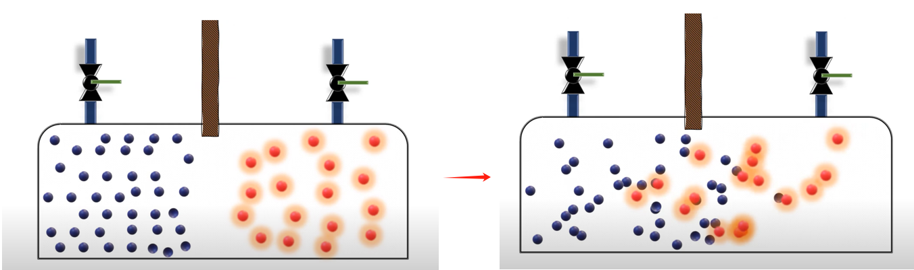
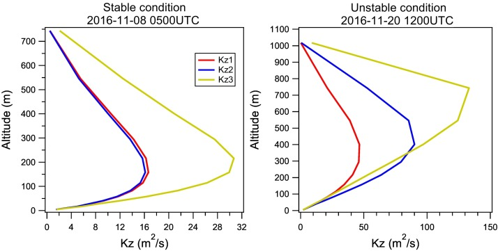
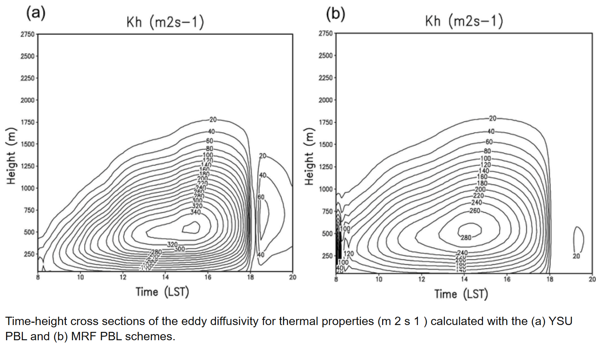
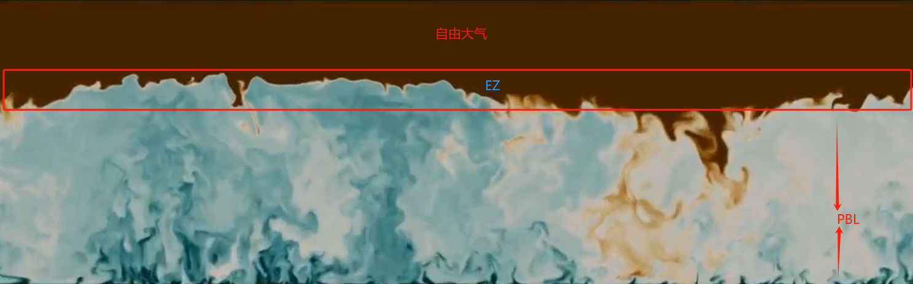
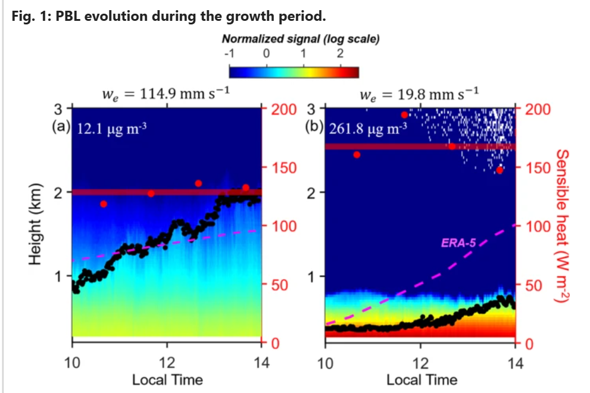

<!-- BEGIN COMMENT -->

 [<< Previous Chapter](NAQPMS_TN_ch03_advection.md)- [Home](README.md) - [Next Chapter >>](NAQPMS_TN_ch05_dry_dep.md)

<!-- END COMMENT -->

# 4. 扩散方案

## 4.1 引言

在空气质量数值模式的语境中，污染物的扩散（湍流扩散）是指大尺度风无法模拟的由于风引起污染物浓度的演变部分。

\[
\mathbf{u} = \mathbf{u}(x, y, z, t)
\]

风矢量是关于时空的连续函数，但数值模式离散化了大气方程，风矢量只在网格点上计算。离散化的风矢量（代表某个的尺度风）只能代表在一个网格中一段时间内（一个时空网格）的平均态（代表性）。

\[
\mathbf{u}_{i,j,k}^n = \left(u_{i,j,k}^n, v_{i,j,k}^n, w_{i,j,k}^n\right)
\]

从物理意义上讲（连续方程、质量守恒），大气运动是连续发生的。离散化的风矢量无法描述的风引起的浓度再分配就是湍流扩散部分。

对风雷诺分解 (Reynolds Decomposition)，\(u^{'}(x,y,z,t)\) 就是我们永远也不可能显示模拟的部分。
\[
\mathbf{u} = \mathbf{u}(x, y, z, t) = \mathbf{u}_{i,j,k}^n + u^{'}(x,y,z,t)
\]

通过对连续方程(一维)进行雷诺分解，忽略二阶小量后可得：

$$
\frac{\partial \bar{c}}{\partial t} = - \frac{\partial (\bar{c} \bar{u})}{\partial x} - \frac{\partial (\overline{c' u'})}{\partial x} 
\tag {1.1}
$$

其中**公式1.1右边第二项**就是扩散项（湍流扩散项）的数学表示，有了湍流项，离散化后的连续方程才算闭合。

## 4.2 K理论

由于\(u^{'}(x,y,z,t)\)未知，只能采用参数化方案的方式去估计扩散项的影响。在气象学、大气污染扩散通常采用一阶涡流粘度方法（k理论、一阶闭合、梯度扩散假设）来求解湍流项，K理论假设湍流扩散与分子扩散类似，引入了一个湍流扩散系数\(K\)来代替分子扩散系数 \(D\).

为什么能把湍流扩散类比为分子扩散？尽管它们的物理机制和作用范围不同（流体的馄钝性、分子的不规则运动），这两种扩散机制在物质传输过程中具有一定的相似性。

- 高浓度向低浓度扩散：大气中的湍流扩散和分子扩散的基本原理都是物质在不同浓度梯度下的流动，湍流作用也会使得浓度达到均衡。

- 随机性：分子扩散是由单个分子的热运动引起的随机过程，而湍流扩散是由气流中的湍流湍动引起的随机过程。

根据菲克定律，分子扩散的通量公式为：
$$ J = -D_t \frac{\partial c}{\partial x}$$

通过引入湍流扩散系数 \(K_t\)（\(m^2s^{-1}\)）， 湍流扩散的通量公式为：
$$\overline{c' u'} \approx -K_t \frac{\partial c}{\partial x}$$

因此湍流扩散项为：
$$
\frac{\partial c}{\partial t} = -\frac{\partial (\overline{c' u'})}{\partial x} \approx \frac{\partial}{\partial x} \left(K_t \frac{\partial c}{\partial x}\right)
    \tag {1.2}
$$

推广到三维情况
$$
\begin{align*}
\frac{\partial c}{\partial t} &=
\frac{\partial}{\partial x} \left(K_x(t) \frac{\partial c}{\partial x} \right) \\
\frac{\partial c}{\partial t} &=
\frac{\partial}{\partial y} \left(K_y(t) \frac{\partial c}{\partial y} \right) \\
\frac{\partial c}{\partial t} &=
\frac{\partial}{\partial z} \left(K_z(t) \frac{\partial c}{\partial z} \right)\\
\tag {1.2}
\end{align*}
$$

由于引起湍流的机制不一样，数值模式会分开处理水平扩散和垂直扩散。水平方向的湍流主要是由于大气风速剪切引起的，而垂直方向的湍流则主要与温度梯度有关。

## 4.3 水平扩散

水平扩散相比于水平输送而言是小量，甚至可以不进行计算。

$$
\begin{align*}
\frac{\partial c}{\partial t} &=
\frac{\partial}{\partial x} \left(K_x(t) \frac{\partial c}{\partial x} \right) \\
\frac{\partial c}{\partial t} &=
\frac{\partial}{\partial y} \left(K_y(t) \frac{\partial c}{\partial y} \right) \tag {1.3}
\end{align*}
$$

水平扩散系数的研究较少，参考CAMx，水平扩散系数的计算公式（以风切变为核心，构造湍流扩散系数）为:

$$
  K_{x, y} = K_0 + \frac{\Delta x \Delta y}{4 \sqrt{2}}
  [(\frac{\partial u}{\partial y} +
    \frac{\partial v}{\partial x})^2
  +(\frac{\partial u}{\partial x} -
    \frac{\partial v}{\partial y})^2]^{1/3}
    \tag {1.4}
$$

其中\(K_0\)的值为

$$
  K_0 = 3 \times 10^{-3} \frac{\Delta x \Delta y}{\Delta t}
$$

为了便于通量的计算，水平扩散系数\(K_{x, y}\) 通常是在 Arakawa C 网格上描述的，对于一个格子而言，有四条边，每条边上均计算一个\(K\)。

**公式1.4**中的\(K\)的计算涉及到空间差分，采用中值差分方案求速度梯度。

对于**公式1.3**，采用前向欧拉进行时间差分。而在计算浓度梯度时，采用一阶差分方案计算浓度梯度。

## 4.4 垂直扩散

白天行星边界层中湍流作用较强，垂直扩散在污染物的垂直浓度分布中起着至关重要的作用。

$$
\frac{\partial c}{\partial t} =
\frac{\partial}{\partial z} \left(K_z(t) \frac{\partial c}{\partial z} \right) 
$$

垂直扩散系数（\(K_z\)）与大气稳定度、湍流特性以及高度等因素相关，其大致的量级为：

1. **稳定大气层**（如夜间或高压系统下，温度逆温或温度梯度较大）：
   - 在稳定条件下，湍流较弱，\(K_z\) 较小，典型值范围为：
   $$
   K_z \approx 10^{-1} - 10^1 \, \text{m}^2/\text{s}
   $$
   
2. **不稳定大气层**（如白天气温较高，温度较强的升温）：
   - 在不稳定条件下，湍流较强，\(K_z\) 较大，典型值范围为：
   $$
   K_z \approx 10^1 - 10^2 \, \text{m}^2/\text{s}
   $$

由于大气垂直层结构的复杂性以及湍流的复杂性，使得\(K_z\)的计算比较困难。

常见的诊断\(K_z\)计算方案如下。

### 1. **混合长度理论**

混合长度理论假设湍流的混合强度由混合长度和速度梯度决定，湍流扩散系数的表达式为：

$$
K_z = l_m^2 \left| \frac{\partial u}{\partial z} \right|
$$

其中：
- \(l_m\) 是混合长度，可通过经验公式计算：
  $$
  l_m = \frac{k z}{1 + k z / L}
  $$
  - \(k\) 为卡门常数，约为 0.4。
  - \(L\) 为莫宁-奥布霍夫长度，用于表征大气稳定度。

**适用条件：**
- 中性或弱稳定条件。
- \(l_m\) 随高度变化，适合边界层中湍流强度分布。

**优点：** 能捕捉局地湍流特性。
**缺点：** 在强不稳定条件下，混合长度的简单参数化可能不准确。

---

### 2. **基于梯度里查森数的参数化方案**

梯度里查森数（\(Ri_g\)）反映了湍流中浮力和剪切的相对重要性，扩散系数根据 \(Ri_g\) 的大小进行参数化：

$$
Ri_g = \frac{g}{\theta} \frac{\partial \theta}{\partial z} \bigg/ \left( \frac{\partial u}{\partial z}^2 + \frac{\partial v}{\partial z}^2 \right)
$$

湍流扩散系数通常分以下情况处理：
- **不稳定条件（\(Ri_g < 0\)）：**
  $$
  K_z = K_0 \left( 1 - a Ri_g \right)
  $$
  - \(K_0\) 是基准扩散系数。
  - \(a\) 是经验系数。

- **中性条件（\(Ri_g = 0\)）：**
  取 \(K_z = K_0\)，通常为固定值。

- **稳定条件（\(0 < Ri_g < Ri_{cr}\)）：**
  $$
  K_z = K_0 \left( 1 - \frac{Ri_g}{Ri_{cr}} \right)^m
  $$
  - \(Ri_{cr}\) 是临界里查森数，通常取 0.25。
  - \(m\) 为调整系数。

- **极稳定条件（\(Ri_g > Ri_{cr}\)）：**
  \(K_z \to 0\)。

**优点：** 能较好地考虑大气稳定性对湍流的影响。  
**缺点：** 需要准确计算梯度，敏感性较高。

### 3. **基于普朗特数的参数化方案**

普朗特数 (\(Pr\)) 是湍流动量扩散与热量扩散的比值，用于间接计算湍流扩散系数：

$$K_z = \frac{K_m}{Pr}$$

其中：
- \(K_m\) 是动量扩散系数，通常通过混合长度理论或经验公式计算。
- \(Pr\) 为湍流普朗特数，取决于大气条件：
  - 中性条件下 \(Pr \approx 0.74\)。
  - 不稳定条件下 \(Pr < 0.74\)。
  - 稳定条件下 \(Pr > 0.74\)。

**优点：** 适合与动量方程和热量方程耦合使用。  
**缺点：** 需独立确定 \(K_m\) 和 \(Pr\)。

---

### 6. **分区参数化法**

根据高度和湍流特性，将边界层分为不同区域，分别使用不同的参数化方案计算 \(K_z\)：
- **表层：** 使用混合长度理论或经验公式。
- **对流层中上部：** 考虑浮力效应，使用 \(Ri_g\) 参数化。
- **顶层及平流层：** \(K_z\) 逐渐减小到一个常数值（如 \(10^{-6} \ \mathrm{m^2/s}\)）。

**优点：** 针对不同层次采用优化方案，适应性强。  
**缺点：** 实现较复杂。

## 4.5 YSU

空气质量数值模式用的比较多的是**YSU参数化方案**。YSU是一种分层参数化方案(Mixed-layer、Free atmosphere、entrainment zone)，并考虑不同稳定性不同大气层中的\(K_z\)计算。

**1. 边界层中的\(K_z\)**

在边界层中，YSU是通过计算动量扩散量和普朗特数，来间接计算湍流扩散系数（根据普朗特数的定义）。

$$K_z = \frac{K_m}{Pr} $$
$$K_m = k w_s z (1-\frac{z}{h})^p \tag {Song(2006) A1}$$
$${Pr} = 1 + (Pr_0 - 1)e^{-3(z-\epsilon h)^2/h^2} \tag {Song(2006) A4}$$

其中：
- \(K_m\) 为动量扩散系数（momentum diffusivity coefficient）
- \(Pr\) 为湍流普朗特数（详细计算参考文献）
- \(k\) 为卡门常数，约为 0.4
- \(z\) 为离地高度
- \(h\) 为边界层高度
- \(w_s\) 为混合层速度尺度（详细计算参考文献）
- \(p\) 剖面形状指数（文献中给了2）
- \(Pr_0\) Prandtl number at the top of the surface layer
- \(\epsilon h\) 为表面层高度，也就是\(0.1 \times h\)

对于不稳定和稳定的PBL，\(w_s\) 和 \(Pr\)的计算不同。在计算PBL内的参数时，通过里查森数（Richardson number, \(Ri\)）来判断大气的不稳定度。\(Ri\)是温度梯度与风速剪切之间的比率。其计算公式为：

$$
Ri = \frac{g}{\theta} \frac{\partial \theta}{\partial z} \left( \frac{\partial u}{\partial z} \right)^{-2}
$$

其中：
- \(g\) 是重力加速度（约 \(9.81 \, \text{m/s}^2\)）。
- \(\theta\) 是位温（虚拟温度），即空气温度和湿度的结合量。
- \(\frac{\partial \theta}{\partial z}\) 是位温随高度的变化率，表示温度垂直梯度。
- \(\frac{\partial u}{\partial z}\) 是风速在垂直方向上的剪切梯度。

在当前数值模式中，只计算了第一层的\(Ri\)来判断整个PBL的稳定性。

通过Ri来判断大气稳定度的方式如下:
- 当 \(Ri > 1\) 时，表明温度梯度主导，气流处于稳定状态，湍流不易发生。
- 当 \(Ri < 1\) 时，风速梯度主导，表明不稳定，大气可能出现湍流。
- 当 \(Ri \approx 0\) 时，风速梯度和温度梯度相对均衡，表明大气处于中性稳定状态。

但是在实际的代码中，是通过0来区分的稳定性的（可能是因为只算了一层，后期要详细核实一下该计算，是否合理）。

---

**自由大气中的\(K_z\)**

在自由大气中，YSU 通过混合长度理论来计算\(K_z\)。

$$
K_z = l_m^2 f_{m,t}(Rig)
\left(\frac{\partial u}{\partial z} \right)
\tag {Song(2006) A15}
$$

$$
  l_m = \frac{k z}{1 + k z / \lambda} \tag {Song(2006) A17}
$$

$$
f(x) =
\begin{cases}
  1-\frac{8Ri_g}{1+1.286 \sqrt{-Ri_g}}, & \text{if } Ri_g \leq 0 \\
  \frac{1}{(1+5Ri_g)^2}, & \text{if } Ri_g > 0
\end{cases}
\tag {Song(2006) A20 A18}
$$

$$
Ri_g = \frac{g}{\theta} \frac{\partial \theta}{\partial z} \bigg/ \left( \frac{\partial u}{\partial z}^2 + \frac{\partial v}{\partial z}^2 \right)
$$

其中：
- \(f_{m,t}(Rig)\) 为稳定性函数
- \(l_m\) 为混合长度
- \(\lambda\) 为渐近长度尺度(文献中给的是150)
- \(Ri_g\) 为梯度里查森数

**夹带层中的\(K_z\)**

夹带层位于边界层的顶部，通常是在混合层和自由大气之间的过渡区。夹带层的特征是大气的垂直混合性较强，来自下方的空气与上方的自由大气进行混合。这一过程被称为夹带（entrainment）。夹带层通常较薄，但在强烈的对流条件下可能会变得比较厚，夹带层的存在对于空气污染的扩散有重要影响（温度属性类型顶层逆温层，但是缺具有很强的湍流输送，由于较强的风切边，突破了逆温属性的限制）。

YSU方案明确考虑了PBL顶部的夹带层过程，解决了以往在强风下的夹带层和边界层增长过快的问题。

$$
K_z = w_e 
\exp \left[ -\frac{(z-h)^2}{\delta^2} \right] 
\tag{Song(2006) A13a}
$$

$$
w_e = \frac{\overline{(-{w' \theta_v'})_h}}
           {\left(\frac{\partial \theta_v}{\partial z}\right)_h} 
\tag{Song(2006) A9}
$$

$$
\delta = h \times (0.02 + 0.05 \times {Ri_c}^{-1} ) \tag{Song(2006) A14}
$$

$$
Ri_c = \frac{g}{\theta_{v}} 
  \times \frac{d\theta_{v}}{dz}
  \times \frac{1}{({w^*}^3 + 5.0{u^*}^3)^{\frac{2}{3}}}
$$

其中：
- \(w_e\) 代表PBL顶层逆温层中的夹带率
- \(\delta\) 夹带层厚度
- \(Ri_c\) 夹带层厚度处的对流理查森数
- \(\theta_{v}\) 夹带层厚度处的平均虚位温
- \(\frac{d\theta_{v}}{dz}\) 为夹带层的虚位温梯度
- \(\exp \left[ -\frac{(z-h)^2}{\delta^2} \right]\) 表示夹带层引起的湍流通量交换随着高度增加，指数衰减。

夹带层的虚温梯度没办法直接求解，假定夹带层的虚温梯度是关于PBL的函数。

$$
\frac{d\theta_{v}}{dz} = f(h) = 0.001h
$$

最后，在求解夹带层\(k_z\)时，融合了自由大气的\(k_z\) 。

$$
k_z = {({k_z}^{ez} \times {k_z}^{fz})}^{\frac{1}{2}}
$$

## 4.6 References:

Hong S Y, Noh Y, Dudhia J. A new vertical diffusion package with an explicit treatment of entrainment processes[J]. Monthly weather review, 2006, 134(9): 2318-2341.

Su T, Li Z, Zheng Y, et al. Aerosol-boundary layer interaction modulated entrainment process[J]. NPJ Climate and Atmospheric Science, 2022, 5(1): 64.

<!-- BEGIN COMMENT -->

 [<< Previous Chapter](NAQPMS_TN_ch03_advection.md)- [Home](README.md) - [Next Chapter >>](NAQPMS_TN_ch05_dry_dep.md) 
NAQPMSv2.4.0 Technical Notes  

<!-- END COMMENT -->